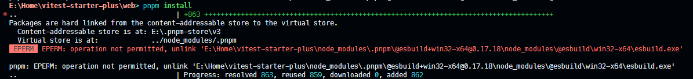

# Vue 3 + TypeScript + Vite + Vitest + wsm + UnoCSS

## TODO

- 文件预览模块
  - 可以使用第三方库如 viewerjs 或 pdf.js 来预览不同类型的文件，如图片、PDF、Word、Excel、PPT等。
对于 Markdown 文件，可以使用 marked 库进行解析，并在页面中渲染出预览效果。
- 文件编辑模块
  - 对于 Markdown 文件，可以使用 editor.md 等第三方库进行编辑器的实现。
对于 Word、Excel、PPT 文件，可以使用 office.js 来实现在线编辑功能。
- 文件上传模块
  - 可以使用 vue-upload-component 或 axios 等库实现文件上传功能。
- 用户身份验证模块
  - 可以使用 JSON Web Tokens (JWT) 实现用户身份认证和授权。
- 数据存储模块
  - 可以使用 localStorage 或 IndexedDB 等浏览器本地存储来保存用户数据。
- 界面设计模块
  - 可以使用 Bootstrap 或 Ant Design Vue 等 UI 框架来快速搭建界面。

## 参考

[前端实现word、excel、pdf、ppt、mp4、图片、文本等文件的预览](https://juejin.cn/post/7071598747519549454#heading-1)
## Q&A

- 老项目集成 pnpm monorepo, 新增 `.npmrc` 文件导致的依赖安装报错

  - 停止项目运行, 删除所有 `node_modules` 文件夹,重新安装依赖
-
